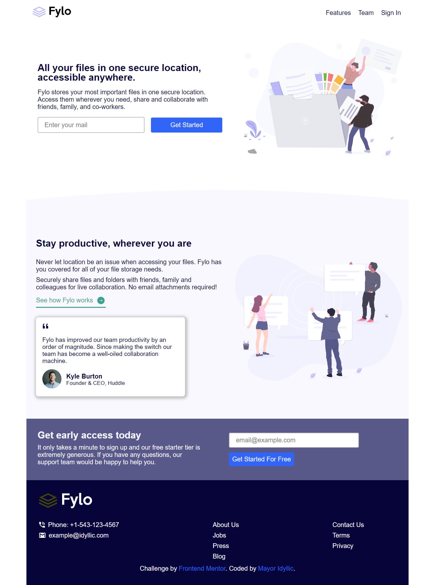

# Frontend Mentor - Fylo landing page with two column layout solution

This is a solution to the [Fylo landing page with two column layout challenge on Frontend Mentor](https://www.frontendmentor.io/challenges/fylo-landing-page-with-two-column-layout-5ca5ef041e82137ec91a50f5). Frontend Mentor challenges help you improve your coding skills by building realistic projects. 

## Table of contents

- [Overview](#overview)
  - [The challenge](#the-challenge)
  - [Screenshot](#screenshot)
  - [Links](#links)
- [My process](#my-process)
  - [Built with](#built-with)
  - [What I learned](#what-i-learned)
  - [Continued development](#continued-development)
- [Author](#author)


## Overview

### The challenge

Users should be able to:

- View the optimal layout for the site depending on their device's screen size
- See hover states for all interactive elements on the page

### Screenshot




### Links

- Solution URL: [https://github.com/Mayor-Isaac/SCSS-fylo.git]
- Live Site URL:[https://idyllic-scss-fylo.netlify.app/]

## My process

### Built with

- Semantic HTML5 markup
- SCSS
- Mobile-first workflow
- Javascript


### What I learned
Intersecting API

```js
const heroObserverFn = function (entries, heroObserver) {
  const [entry] = entries;
  if (entry.isIntersecting === false) {
    heroText.classList.add('slideRight')
  } else {
    heroText.classList.remove('slideRight')
  }
};
const observerObj = {
  root: null,
  threshold: 0,
  rootMargin: '90px',
};
const heroObserver = new IntersectionObserver(heroObserverFn, observerObj);
heroObserver.observe(header);
```


### Continued development

Mobile first workflow and SASS


## Author

- LinkedIn - [Feranmi Ogunyileka](https://www.linkedin.com/in/feranmi-ogunyileka-359a1723b)
- Frontend Mentor - [@Mayor-Isaac](https://www.frontendmentor.io/profile/Mayor-Isaac)
- Twitter - [@mayor_idyllic](https://www.twitter.com/mayor_idyllic)
- Stack overflow - [@ogunyileka-feranmi](https://stackoverflow.com/users/21688342/ogunyileka-feranmi)
